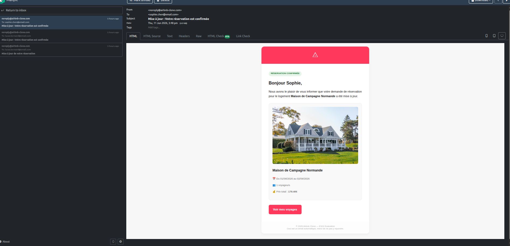
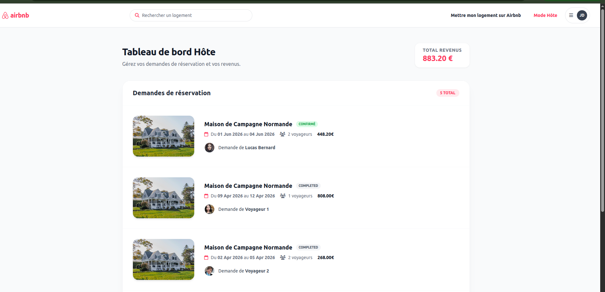

# Airbnb Clone - Moteur de Réservation & Calendrier iCal

Ce projet est une implémentation avancée d'un système de réservation pour une plateforme type Airbnb, réalisée sous Symfony 8.

##  Fonctionnalités implémentées

### 1. Moteur de Réservation (Booking Engine)
*   **Workflow complet** : Gestion des états de réservation (`pending`, `confirmed`, `cancelled`).
*   **Réservation Instantanée** : Les logements avec `instantBooking` sont confirmés automatiquement.
*   **Modération Hôte** : Dashboard dédié permettant aux hôtes d'accepter ou de refuser des demandes avec un motif obligatoire en cas de refus.
*   **Gestion des disponibilités** : Système anti-overbooking (vérification de superposition des dates) et blocage manuel de dates par l'hôte.

### 2. Synchronisation iCal
*   **Export iCal** : Flux `.ics` sécurisé par un jeton unique pour chaque logement. Permet de synchroniser ses réservations vers Google Calendar, Airbnb, etc.
*   **Import iCal** : Commande console pour synchroniser des calendriers externes et bloquer les dates automatiquement.

### 3. Notifications & Performance
*   **Emails riches** : Utilisation de templates HTML/Twig premium pour les confirmations et refus.
*   **Asynchronisme** : Intégration de Symfony Messenger pour l'envoi des emails en tâche de fond (async).

## Points d'entrée (Endpoints)

| Rôle | Route | Description |
|:---|:---|:---|
| **Voyageur** | `/logement/{id}/reserver` | Formulaire de réservation. |
| **Hôte** | `/host/reservations` | Dashboard de modération des demandes. |
| **Hôte** | `/host/logement/{id}/disponibilites` | Blocage manuel de dates. |
| **Public** | `/api/properties/{id}/calendar.ics?token=xxx` | Flux d'export iCal sécurisé. |
| **Admin** | `/admin` | Interface d'administration globale. |
| **Technique** | `http://localhost:8025` | Interface Mailpit pour voir les emails envoyés. |

## Comptes de Test

Tous les comptes utilisent le mot de passe : `password`

| Rôle | Email | Scénario à tester |
|:---|:---|:---|
| **Super Admin** | `admin@airbnb-clone.fr` | Gestion globale sur `/admin` |
| **Hôte (Host)** | `jeanmarc.dupont@email.com` | Accepter/Refuser sur `/host/reservations` |
| **Voyageur (Guest)** | `sophie.chen@email.com` | Faire une demande de réservation. |
| **Voyageur (Guest 2)** | `lucas.bernard@email.com` | Tester le blocage (overbooking). |

## Expérience Utilisateur (UX) & Design

Le projet a été enrichi avec une attention particulière portée au design :
*   **Interface Hôte Premium** : Dashboard conçu avec TailwindCSS (Cards, Glassmorphism, animations au survol).
*   **Navigation Intuitive** : Ajout d'un bouton "Mode Hôte" dynamique dans le header pour basculer facilement.
*   **Feedback Visuel** : Gestion des messages d'erreur et de succès via des notifications "Flash" animées et compatibles avec Turbo.
*   **Emails Stylisés** : Les notifications ne sont plus en texte brut mais utilisent un template responsive aux couleurs de la marque.
*   **Optimisation Turbo** : Intégration des codes HTTP 422 pour une fluidité parfaite du tunnel de réservation sans rechargement de page complet.

## Installation & Lancement

1.  **Lancer l'environnement** : `make start`
2.  **Installer les dépendances** : `make install`
3.  **Charger les données de test** : `make fixtures`
4.  **Lancer le worker email** : `make worker`

## Galerie Aperçu

